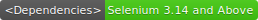

<h1>Smart Instagram Bot</h1>

  

Smart Instagram Bot is a <b>Work in Progress</b>. It aims at making more meaningful and conversational bots, getting  <b>rid</b> of all those annoying monotonous bots! I have uploaded the first file, <i>Bot.py</i> ,that is the Bot itself. Several functionalities are missing, but I will be adding them in the coming weeks.

<h2> Brief Exaplanations of the files</h2>

<h3><i>Bot.py</i></h3>
<b>Bot.py</b> is the file that follows and likes the pictures of as per given the hashtags and number of Likes/Follows. The file saves the usernames of the followed people to a list. This list is then converted to a pickle file and stored on your computer. I have also added more randomization to the bot to prevent it being detected by Instagram

<h3><i>UnBot.py</i></h3>
<b>UnBot.py</b> is the file that unfollows the people that you followed. The reason for this is that Instagram has a follow limit of 7,500. Therefore we got to unfollow the people we earlier followed. This is done by loading the pickle file that we earlier saved and unfollowing each of them. The limit to how many to unfollow can be modified.

<h3>To-Do List</h3>

Here is a list of features currently on the bucketlist that I will be adding. Want more? Contact me
  <ul>
  <li><strike><b>Commenting</b></strike></li>
  <li><strike><b>Using Geo-Tagging</b></strike></li>
  <li><strike><b>Randomization</b></strike></li>
  <li><b>Advanced Randomizations</b></li>
  
</ul>

The <i>Smart</i> part of it, I still have to figure out. Currently making a DataSet for the same to train on.

Contact me at - cabhijith001@gmail.com for any suggestions/advice etc.

<i> Excessive use of this tool can lead to Instagram banning your account. Use within limits</i>
